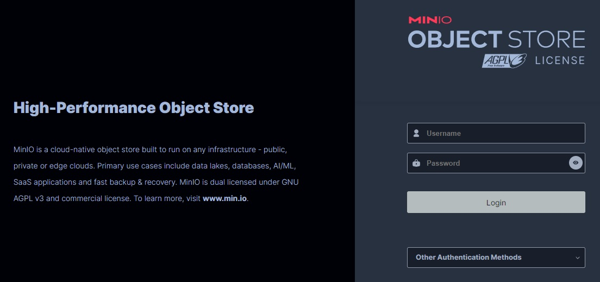
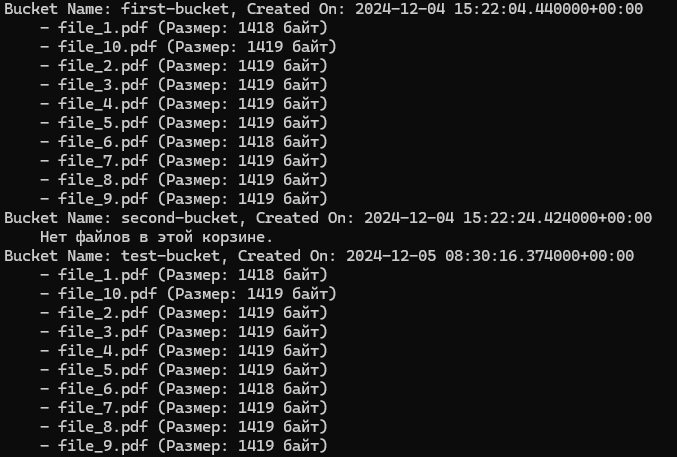

# MinIO File Storage

 


## Особенности

- Получение списка корзин

## Установка

1. Установка и запуск Minio
  ```bash
  git clone https://github.com/froyzan/Minio.git
  cd Minio
  chmod +x setup_minio.sh
  sudo ./setup_minio.sh
  ```
2. Установка зависимостей
  ```bash
  pip install -r requirements.txt
  ```

3. Список корзин
  ```bash
  python3 list_buckets.py
  ```
 

`<link>` : <http://localhost:9001>
  ```html
  User: minioadmin
  Password: minioadmin
  ```
